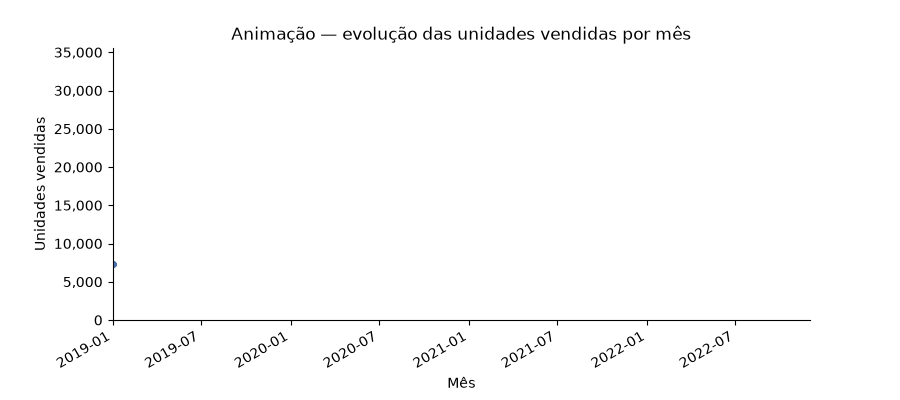
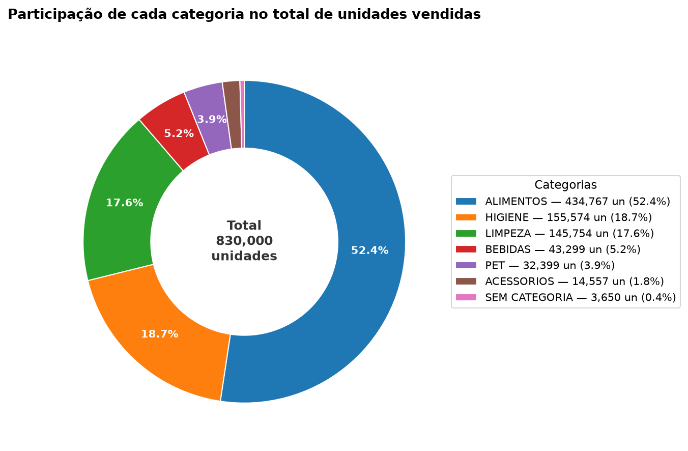
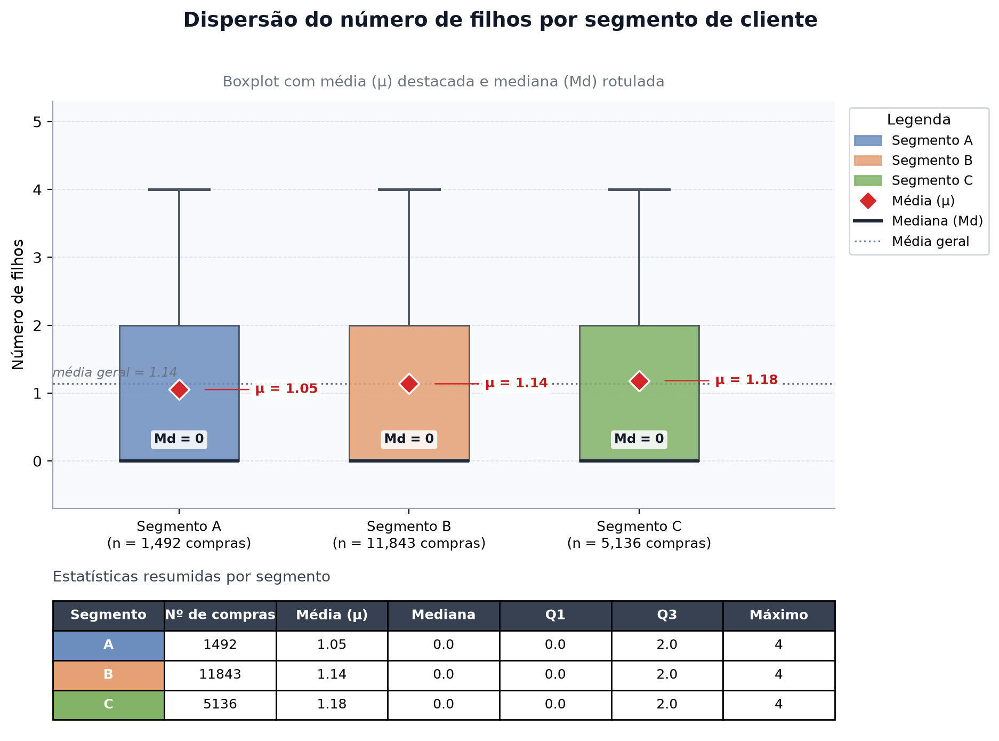
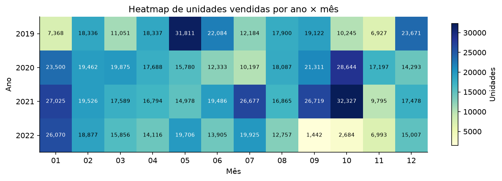

# Mini-Projeto Avaliativo — Análise Exploratória de Dados (Base Varejo)

**Autor:** Julcemar Justino Felipe
**Turma:** Analise_de_Dados_T6
**Disciplina:** Análise de Dados com Python
**Base de dados:** [Base Varejo — Kaggle](https://www.kaggle.com/datasets/namespaiva/base-varejo/data)

---

## 📖 1. Sobre o projeto

Notebook que executa uma **Análise Exploratória de Dados (AED)** completa sobre uma
base de compras de varejo (~830.000 linhas × 10 colunas), seguindo um fluxo de ETL
organizado em 6 sprints:

1. **Sprint 1** — Carregamento e inspeção inicial;
2. **Sprint 2** — Diagnóstico de qualidade dos dados;
3. **Sprint 3** — Limpeza com justificativa das decisões;
4. **Sprint 4** — Validação da regra de negócio do `CO_ID`;
5. **Sprint 5** — Estatísticas descritivas (número de filhos);
6. **Sprint 6** — Agrupamentos, visualizações variadas (incluindo **animação**) e insights.

### Entregáveis
| Arquivo | Conteúdo |
|---|---|
| `df_limpo.csv` | Base limpa em nível de **item**, com a coluna `QUANTIDADE` |
| `df_compras.csv` | Base em nível de **compra** (1 linha por `CO_ID`) |
| `vendas_anim.gif` | Animação das vendas mensais (gerada na Sprint 6.7) |

---

## 🚀 2. Instruções para rodar

1. Baixe a base `Base Varejo.csv` no Kaggle:
   <https://www.kaggle.com/datasets/namespaiva/base-varejo/data>
2. Coloque o `Base Varejo.csv` na mesma pasta do notebook `Base_Varejo.ipynb`.
3. Abra o notebook no **Google Colab** (upload do `.ipynb` + do `.csv`) ou no
   **VSCode** (extensão Jupyter) e rode todas as células, em ordem.
4. O relatório da análise aparece na saída de cada célula; os arquivos entregáveis
   e a animação são gerados na mesma pasta ao final.

### Requisitos

```bash
pip install pandas numpy matplotlib pillow
```

---

## 🗂️ 3. Dicionário de dados

| Coluna | Significado |
|---|---|
| `DATA` | Data da compra (texto `dd/mm/aaaa` no arquivo original) |
| `CO_ID` | Identificador da compra (repete em cada item da mesma compra) |
| `CL_ID` | Identificador do cliente |
| `CL_GENERO` | Gênero do cliente (`M` / `F`) |
| `CL_EC` | Estado civil (`1` casado/união estável; `2` divorciado; `3` separado; `4` solteiro; `5` viúvo) |
| `CL_FHL` | Número de filhos do cliente |
| `CL_SEG` | Segmento do cliente (`A` / `B` / `C`) |
| `PR_ID` | Identificador do produto |
| `PR_CAT` | Categoria do produto (`#N/D` quando não informada) |
| `PR_NOME` | Nome do produto |

---

## 🔁 4. Pipeline e principais achados por Sprint

| Sprint | Etapa | O que foi feito / encontrado |
|---|---|---|
| 1 | Carregamento e inspeção | `read_csv(sep=";")`; 830.000 linhas × 14 colunas (4 colunas "fantasmas" criadas pelo `;` sobrando no fim das linhas do cabeçalho) |
| 2 | Diagnóstico | 4 colunas vazias; 0 nulos; 3.650 registros com categoria `#N/D` (todos do `PR_ID` 107); 96.553 linhas 100% duplicadas; 0 datas inválidas; inconsistência de caixa em `REFRIGERANTE LIMaO` |
| 3 | Limpeza | Colunas vazias removidas; `#N/D` → `Sem Categoria` / `Produto Nao Informado`; texto padronizado em caixa alta; `DATA` → `datetime`; duplicadas convertidas na coluna `QUANTIDADE` (830.000 → 733.447 linhas, sem perder unidades vendidas) |
| 4 | Regra do `CO_ID` | 0 compras com cliente inconsistente → regra validada; criada `df_compras` com 18.471 compras e 1.000 clientes |
| 5 | Estatísticas descritivas | `CL_FHL` por cliente: média 1,14; mediana 0; desvio 1,41; mín 0; máx 4; Q1 0; Q3 2 |
| 6 | Agrupamentos e insights | 5 agrupamentos + visualizações complementares (donut, boxplot, heatmap e animação GIF); 6 insights finais |

---

## 📊 5. Visualizações utilizadas

O notebook varia propositalmente o **tipo de figura** conforme a pergunta de análise:

| # | Tipo de gráfico | Sprint | Para quê |
|---|---|---|---|
| 1 | Barras com rótulos de valor | 5 e 6.1 | Distribuição de filhos; unidades e compras por gênero |
| 2 | Ranking horizontal (`barh`) | 6.2 | Ranking de categorias por unidades |
| 3 | Heatmap de tabela pivô | 6.3 | Cruzamento gênero × categoria |
| 4 | Série temporal (linha + marcadores) | 6.5 | Vendas mensais 2019–2022 |
| 5 | Gráfico de donut | 6.7 | Participação de cada categoria no total |
| 6 | Boxplot | 6.7 | Dispersão e outliers de filhos por segmento |
| 7 | Heatmap ano × mês | 6.7 | Sazonalidade das vendas |
| 8 | Animação (GIF) | 6.7 | Evolução mês a mês da série temporal |

### Animação da série temporal



### Gráficos complementares

**Gráfico donut — participação por categoria**


**Boxplot — filhos por segmento**


**Mapa de calor — vendas por ano × mês**


---

## 💡 6. Principais insights

1. A base cobre **18.471 compras** de **1.000 clientes distintos**, entre **04/01/2019** e **08/12/2022**.
2. **ALIMENTOS** lidera com **434.767 unidades** — muito acima das demais (HIGIENE 155.574; LIMPEZA 145.754).
3. O gênero **F** concentra mais compras (**9.615** vs. 8.856 de M), mas a diferença é pequena: não há público dominante.
4. **100%** dos 3.650 registros com categoria `#N/D` vêm de um único produto (`PR_ID` 107): não é erro aleatório, é falta de cadastro.
5. As **96.553** linhas duplicadas não foram descartadas: viraram a coluna `QUANTIDADE`, preservando a informação real de unidades por compra.
6. A média de filhos por cliente é **1,14** (mediana 0); o segmento **C** tem a maior média (1,18) — útil para campanhas por perfil familiar.

---

## 📁 7. Estrutura do projeto

```text
.
├── Base_Varejo.ipynb          # notebook com a análise completa
├── Base Varejo.csv            # base original (Kaggle)
├── README.md                  # visão geral do projeto
├── README_Julcemar_Felipe_Analise_de_Dados_T.md   # este arquivo
├── df_limpo.csv               # entregável (nível item)
├── df_compras.csv             # entregável (nível compra)
├── vendas_anim.gif            # animação (Sprint 6.7)
└── figuras/
    ├── donut_categorias.png
    ├── boxplot_filhos_segmento.png
    └── heatmap_ano_mes.png
```

---

## 🧠 8. Reflexão teórica (ETL e qualidade de dados)

Fazer este mini-projeto me fez viver na prática as três etapas do ciclo de ETL.
No **Extract**, percebi que o formato físico do arquivo dita o carregamento: o
separador `;`, as datas armazenadas como texto e um `;` sobrando no fim de cada
linha do cabeçalho — que criou quatro colunas 100% vazias. No **Transform**,
aprendi que limpar não é apenas apagar: cada decisão exige justificativa técnica,
como converter as 96.553 duplicidades em uma coluna `QUANTIDADE` (apagar as linhas
descartaria vendas reais) e tratar `#N/D` como "Sem Categoria" sem excluir o item,
já que o produto foi de fato comprado. No **Load**, entreguei a base em dois
níveis (item e compra), cada um adequado a um tipo de pergunta.

Sobre **qualidade de dados**, a maior lição foi que problemas podem ficar
escondidos: `#N/D` não aparece no `isnull()` por ser uma string, e inconsistências
como `LIMaO` vs. `LIMAO` dividem silenciosamente um `groupby()`. Com mais tempo,
eu automatizaria essas verificações como testes de qualidade de dados (asserts de
formato, unicidade de chaves e domínios permitidos), publicaria um painel
interativo e aprofundaria a série temporal com decomposição de sazonalidade.

---

## 📚 9. Referências

- Base Varejo (Kaggle): <https://www.kaggle.com/datasets/namespaiva/base-varejo/data>
- Documentação do pandas: <https://pandas.pydata.org/docs/>
- Documentação de animações do Matplotlib: <https://matplotlib.org/stable/api/animation_api.html>
- Ferramenta de apoio (IA generativa): GOOGLE. Gemini. [Modelo de linguagem de
  inteligência artificial]. Mountain View: Google, 2026. Disponível em:
  <https://gemini.google.com>. Utilizado como suporte na ideação de código,
  estruturação e revisão da documentação técnica.
- Material da disciplina Análise de Dados com Python (Turma T6).
